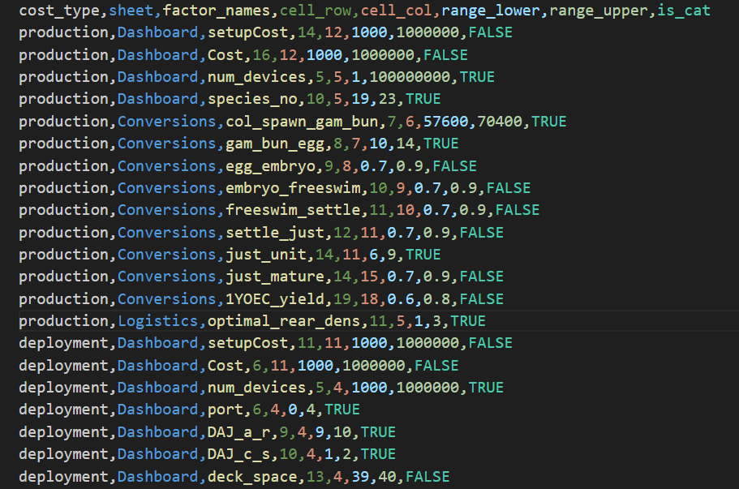

## Cost-eco-model-linker

A python library for generating input files for the CREAM economics analysis suite, using result sets from ReefModEngine.jl and sampling the intervention cost models using the cost_model_queries package.

### Sampled metrics output files

Cost-eco-model-linker generates sampled economics metric files, including the Reef Condition Index, Reef Fishing Index and Reef Tourism Index, in a format suitable for input to [CREAM](https://github.com/gbrrestoration/CREAM). The metrics are calculated from results
generated by the ecological model [ReefModEngine.jl](https://github.com/open-AIMS/ReefModEngine.jl).

### Sampled costs outputfiles

Cost-eco-model-linker generates sampled cost output files for each of the interventions modelled in a set of ReefModEngine.jl results. Currently the latest version of the cost models that Cost-eco-model-linker is compatiable with are:
- Coral Aquaculture Deployment "3.5.5 CA Deployment Model.xlxs"
- Coral Aquaculture Production "3.7.0 CA Production Model.xlxs"

### Configuration files

Two configuration files are required for the cost model sampling component of this repository. A `config.csv` file is required to designate the names, types and positions of cost model parameters, such as in the example below:

Another `config.json` file specifies "deploy_model_filepath" and "deploy_prod_filepath" which are the filepaths to the deployment and production cost models respectively.

#### See the full docs for environment set up, examples, and descriptions of the cost and ecological modelling.

