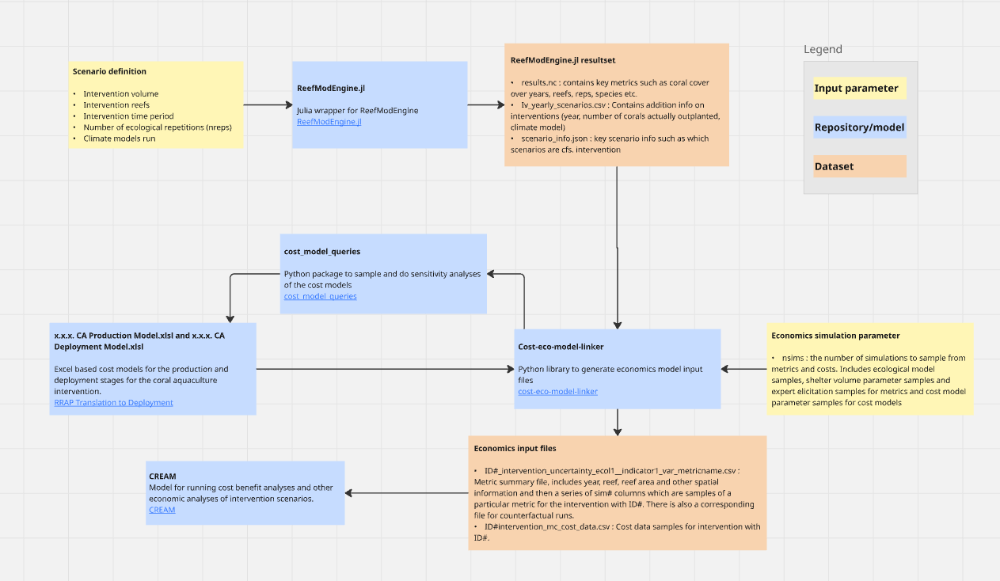

# Cost-eco-model-linker

[](https://cost-eco-model-linker.readthedocs.io/en/latest/?badge=latest)



A python library for generating input files for the CREAM economics analysis suite, using result sets from ReefModEngine.jl and sampling the intervention cost models using the cost_model_queries package.

## Quick setup

```shell
# Initialize project
$ uv init

# Create project environment
$ uv venv

# Activate project environment
# this command will differ slightly on *nix
$ .venv\Scripts\activate

# This should install dependencies and change the initial prompt to:
(cost-eco-model-linker) $

# Now if you run `python`, the python install for the environment will be launched
(cost-eco-model-linker) $ python
Python 3.12.10 (main, Apr  9 2025, 04:06:22) [MSC v.1943 64 bit (AMD64)] on win32
Type "help", "copyright", "credits" or "license" for more information.
Ctrl click to launch VS Code Native REPL
>>>
```

## Development setup

Assuming the current directory is the repository root:

```shell
# Add formatter and linter
$ uv add --group lint ruff

# Add ipython for better REPL experience
$ uv add --group dev ipython ipdb

# Add this package for development
$ uv pip install -e .
```

This project uses the Ruff python formatter.

For Visual Studio Code users, install the `Ruff` Python formatter extension.

### Sampled metrics output files

Two configuration files are required for the cost model sampling component of this repository.

- `src/config.csv` : Doesn't need to be manually created by the user. Designate names, types and positions of cost model parameters.
- `src/config.json` : Needs to be manually created by the user. Specifies "deploy_model_filepath" and "deploy_prod_filepath", which are the filepaths to the deployment and production cost models respectively. The deployment and production models versions know to work  with the current version of this repo are, respectively, `3.5.5` and `3.7.0`.
    ```json
    {
        "deploy_model_filepath": <"path to 3.5.5 CA Deployment Model">,
        "prod_model_filepath": <"path to 3.7.0 CA Production Model">
    }
    ```

## Quickstart

After creating a `config.json` file as explained above, the metric data files can be created with:

```
import src.cost_calculations as cc
import src.process_RME_data as prd

# Filepath to RME runs to process
rme_files_path = "path to ReefModEngine.jl results"

# Number of sims for metrics sampling (default includes ecological and expert uncertainty in RCI calcs)
nsims = 300

# Create metric data files for economics modelling and extract filename for intervention key
# nbatches = nsims and ncores = 1 if not using parallelisation
int_keys_fn, filepaths = prd.create_economics_metric_files(rme_files_path, nsims, nsims, ncores=1)
```


## Sampled metrics output files

Cost-eco-model-linker generates sampled economics metric files, including the Reef Condition Index, Reef Fishing Index and Reef Tourism Index, in a format suitable for input to [CREAM](https://github.com/gbrrestoration/CREAM). The metrics are calculated from results
generated by the ecological model [ReefModEngine.jl](https://github.com/open-AIMS/ReefModEngine.jl).

## Sampled costs output files

Cost-eco-model-linker generates sampled cost output files for each of the interventions modelled in a set of ReefModEngine.jl results. Currently the latest version of the cost models that Cost-eco-model-linker is compatiable with are:

- Coral Aquaculture Deployment "3.5.5 CA Deployment Model.xlxs"
- Coral Aquaculture Production "3.7.0 CA Production Model.xlxs"

To get access to these models, contact Nick Dendle at QUT.

### See the full docs for environment set up, examples, and descriptions of the cost and ecological modelling.
