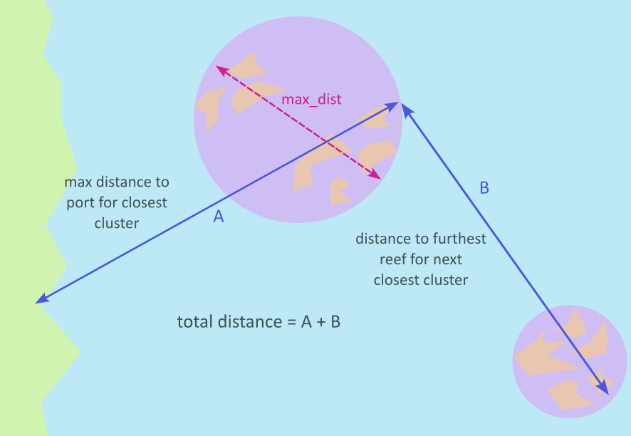

# Cost Models

The cost models used to calculate intervention costs are Excel-based models developed by
the RRAP Translation to Deployment team. The models must be requested via QUT (Nick Dendle
at QUT).

The compatible versions of the cost models are:

- Coral Aquaculture Deployment : `3.8.0 CA Deployment Model.xlsx`
- Coral Aquaculture Production : `3.8.0 CA Production Model.xlsx`

## Configuration files

Sampling of cost models are dependent on two configuration files.
The first is the `config.csv` file which defines the names, cell positions, and sampling
ranges of cost model parameters. A copy of this CSV file is bundled with the package
(at `cost_eco_model_linker/config.csv`).

It is currently not possible to provide a different `config.csv` file.

An example of this file for the latest compatible cost model versions is below:

```{csv-table} Config file for latest model version
:header-rows: 1
:file: config.csv
```

At minimum, the file must include the following columns:

- `cost_type` : the model type the parameter belongs to (currently either `production` or `deployment`).
- `sheet` : the sheet name the parameter occurs on.
- `factor_names` : a label for the factor.
- `cell_row`, `cell_col`: the cell row and column reference for the parameter.
- `range_lower`, `range_upper` : the upper and lower bounds for sampling the parameter.
- `is_cat` : a flag designating whether the parameter is categorical or not.

The `config.csv` should include info for `setupCost` and `Cost` parameters for both the `production` and `deployment` models, parameters which are used to extract the setup
(CAPEX) and operational (OPEX) cost respectively for a given intervention.

## Cost model parameter descriptions

The following table describes the key parameters sampled in the deployment and production cost models.
There are many other parameters which could be sampled, but the following were chosen as key sources of uncertainty
through consultation with the Translation to Deployment Team and sensitivity analyses.

| **Parameter name** | **Description** | **Expected range** | **Model** |
|--------------------|-----------------|-------------------|-----------|
| num_devices | The number of devices outplanted in a year. Each device carries 3 baby corals, with a survival rate to 1YO of *1YOEC_yield*. | (1000, 5000000) | Deployment and Production |
| species_no | Number of unique species/regions combinations to be outplanted. Each species and region needs different tanks for production. | (1, 12+) | Production |
| col_spawn_gam_bun, gam_bun_egg, egg_embryo, embryo_freeswim | Parameters detailing conversions from the spawn to gamete to egg to embryo to freeswimming stage of the coral lifecycle. | See example config file | Production |
| freeswim_settle, settle_just, just_mature | Parameters detailing conversions from the freeswimming to settlement-ready larvae, to just-settled larva to just-settled unit to mature unit. | See example config file | Production |
| 1YOEC_yield | The number of surviving 1 YO corals per outplanted device. | (0.6, 0.8) | Production and Deployment |
| optimal_rear_density | The optimal density to rear baby corals at. | (1,3) | Production |
| port | Index specifying which of port to use, generally overwritten in favour of using distance to port directly. | (0,4) | Deployment |
| DAJ_a_r | DAJ assembly rate (jig-sec/device). | (9, 10) | Deployment |
| DAJ_c_s | DAJ count at sea (DAJ/ship) | (1,2) | Deployment |
| deck_space | Deck space on the ship in m2 | Depends on the ship being used | Deployment |
| cape_ferg_price | Daily rate of the ship being used | Depends on the ship | Deployment |
| ship_endurance | Number of days the ship can stay out without going back to port | Depends on ship | Deployment |
| distance_from_port | Distance from port to intervention reef in nautical miles | Depends on intervention reef(s) | Deployment |
| secs_per_dev | On transect deployment rate of devices | (1,2) | Deployment |
| proportion | Proportion by which device deployment rate is reduced due to poor visibility | (0.5,0.55), but depends on conditions | Deployment |
| bins_per_tender | Bins holding devices that can fit in each tender | (4,6) but depends on tender | Deployment |
| deployment_dur | Days over which the deployment occurs | (25, 28) | Deployment |

## Sampling the cost models

The Excel-based cost models give CAPEX and OPEX costs of the production and deployment
stages of outplanting corals, for a particular input deployment volume, number of species,
distance from port to the deployment reef, and other factors, primarily for the ReefMod
Engine model. Further details are found in the [documentation](https://open-aims.github.io/cost-eco-model-linker/context/02_EcologicalModels.html#reefmod).

## Cost model samples output file

The output files for the cost sampling include 11 cost codes for each intervention year and
simulation which are used by `CREAM`. These are described in the following table:

| **Cost code** | **Cost component** | **Description** |
|---------------|-------------------|-----------------|
| 1 | CAPEX | Sum of setup (capital expenditure) costs for the production and deployment stages. |
| 2 | Contingency of CAPEX | % of CAPEX, default is 25%. |
| 3 | OPEX | Sum of operational costs for the production and deployment stages. |
| 4 | Sustaining capital OPEX | Set to zero for now (assumed to be included in OPEX through the contract). |
| 5 | Contingency of OPEX | % of OPEX, default is 25%. |
| 6 | Vessel fuel | Only relevant if volunteer vessels are used, set to zero for now. |
| 7 | CAPEX - monitoring | Set to zero (assumed no monitoring cost). |
| 8 | Contingency CAPEX-monitoring | % of CAPEX monitoring. |
| 9 | OPEX - monitoring | Set to zero (assumed no monitoring cost). |
| 10 | Sustaining capital OPEX - monitoring | Set to zero (assumed no monitoring cost). |
| 11 | Contingency OPEX-monitoring | % of OPEX monitoring |

## Calculating costs for interventions over multiple years

For outplanting corals over multiple years, the setup costs of production and deployment
only scale with the *additional* corals planned for outplanting compared to the previous
year. For example, if 100,000 corals are deployed in the first year, 200,000 in the second
year and 200,000 in the third year, the setup costs are \$X, \$X and \$0 respectively. The
operational costs are calculated the same way regardless of the year. These year-by-year
setup cost differences are not specified in the Excel models, but are handled within
the functions `cost_calculations.calc_production_requirement()` and
`cost_calculations.calculate_costs()`.

In particular, for years beyond the first intervention year, the costs are sampled first
using the total number of outplants to extract the operational cost. Then the difference in
number of corals between the current and previous year is calculated. For differences less
than or equal to 0, the setup cost is set to zero. For differences in number of corals
greater than zero, the cost is resampled for the difference in number of corals and just
the setup cost is updated. This requires double sampling, so interventions which
continuously increase the number of outplanted corals over time can take longer to run.

## Calculating distance to port for multiple reefs

The Excel-based cost models take as input a single value for distance to port to calculate
deployment costs, so it is not specified how to deal with intervening on multiple reefs.
For multiple intervention reefs for a single intervention, the total distance to port is
calculated as follows:

1. The intervention reefs are clustered into groups of reefs which are a maximum distance \
   apart (set by parameter `max_dist`).
2. The initial distance to port is set as the maximum distance to port for reefs in the \
   closest cluster to port.
3. For the remaining clusters, distances are calculated between the furthest reefs from \
   port in each cluster.
4. The total distance travelled is then estimated as the initial distance to the closest \
   cluster's furthest reef plus the remaining distances between the furthest reefs from  \
   port in each of the remaining clusters, travelling in order from closest cluster to  \
   port to furthest cluster from port.


