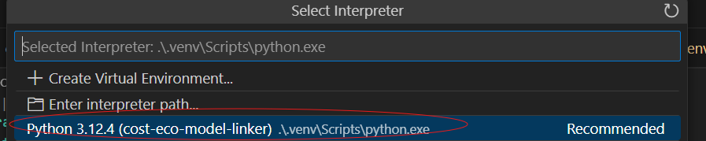

# Environment Setup

`rrap-cost-linker` is not a registered Python package. To set up for local use,
clone the repository.

Package environment and dependencies are managed with [`uv`](https://docs.astral.sh/uv/getting-started/installation/).

This can be installed in the global Python environment with:

```shell
$ pip install uv
```


Once the repository is cloned,
simply run:

```shell
# Initialize project environment and install all dependencies
$ uv sync

# This should change the initial prompt to:
(rrap-cost-linker) $
```

## Development setup

Assuming the current directory is the project root:

```shell
# Add formatter and linter
(rrap-cost-linker) $ uv sync --group lint

# Add dev packages
(rrap-cost-linker) $ uv sync --group dev
```

In VS code, the corresponding virtual environment can be selected by selecting the interpreter in the bottom right of the screen:


And then selecting the virtual environment:



To use `rrap-cost-linker`,

Copies of the cost models and associated configuration must be had to use
`rrap-cost-linker`.

See [cost_models](cost_models.md) for further details.
