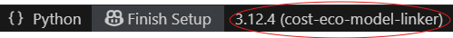

Environment setup
=================

`Cost-eco-model-linker` uses `uv` to manage and maintain a consistent Python environment.
To initialise the environment, `uv` needs to be installed and available in the location
where the environment is being initialised.

One option is to install `uv` directly in VS code using pip:

.. code-block:: console

    $ pip install uv

Other options for installing `uv`, and information on environment maintainance can be found
at the `uv` - Astral website, `https://docs.astral.sh/uv/getting-started/installation/`_.

The virtual environment can then be initialised by syncing the `uv.lock` file:

.. code-block:: console

    uv sync

In VS code, the virtual environment can be selected by selecting the interpreter in the bottom right of the screen:

And then selecting the virtual environment:

.. image:: select_environment.png
  :width: 800

To run a script, navigate to the src folder, in the VS code command prompt terminal (not the powershell):

.. code-block:: console

    (cost-eco-model-linker) C:\Documents\cost-eco-model-linker cd src

Then run a script using,

.. code-block:: console

    (cost-eco-model-linker) C:\Documents\cost-eco-model-linker\src python example-process-rme-runs.py

To run the example files you will need to first create config files and correctly name the downloaded cost models.
See :doc:`cost_models` for how to create the config files and cost model names.

Run the commands below to create and activate the project environment

.. code-block:: console

    uv init
    uv venv
    .venv\Scripts\activate  # this command will differ slightly on *nix
