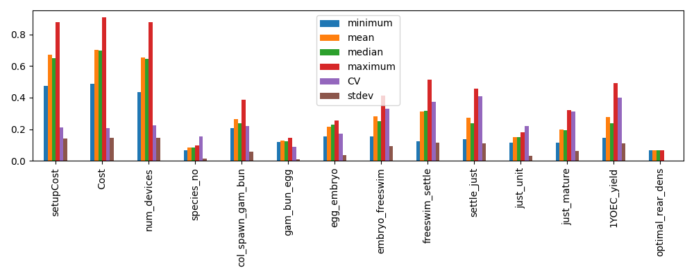

# Example workflow

```python
import rrap_cl as cl

# Filepath to RME runs to process
rme_files_path = "./data/eco_linker_example"
deployment_model = "./3.9.0 CA Deployment Model.xlsx"
production_model = "./3.9.1 CA Production Model.xlsx"
lm_model = "./3.9.6 LM Model.xlsx"
output_path = "./results"
unc_config = cl.default_uncertainty_dict()

# Change the entries in `unc_config` if needed
# unc_config["rti_uncert"] = 0

# Number of sims for metrics sampling (default includes ecological and expert uncertainty in RCI calcs)
nsims = 10

cl.evaluate(
    rme_files_path,
    nsims,
    deployment_model,
    production_model,
    lm_model,
    output_path,
    uncertainty_dict=unc_config,
)
```

For parallel runs:

```python
nsims = 10
ncores = 4

if __name__ == "__main__":
    cl.evaluate(
        rme_files_path,
        nsims,
        deployment_model,
        production_model,
        lm_model,
        output_path,
        uncertainty_dict=unc_config,
        nprocs=ncores,
    )
```

## Sensitivity analysis

```python
import rrap_cl as cl

prod_cost_model = "./models/3.9.1 CA Production Model.xlsx"
deploy_cost_model = "./models/3.9.0 CA Deployment Model.xlsx"

# Number of samples to take (must be power of 2)
N = 2**7

# Samples model and returns an SALib problem specification with results under the
# `cost_model_results` key.
prod_sp = cl.run_production_model(prod_cost_model, N)
deploy_sp = cl.run_deployment_model(deploy_cost_model, N)

# Conduct and save sensitivity analysis results
cl.extract_sa_results(prod_sp, "./figs/prod/")
cl.extract_sa_results(deploy_sp, "./figs/deploy/")
```

The above will generate a set of figures (for production or deployment costs).

Example PAWN analysis results:




## Running models directly

The model type (`production` or `deployment`) and config version are inferred
automatically from the workbook filename, so you only need to supply the path.

### Single evaluation

`evaluate_production_cost` and `evaluate_deployment_cost` accept keyword arguments
for any factor you want to override; all other factors default to the values currently
in the spreadsheet. Both return `(capex, opex)`.

```python
import rrap_cl as cl

production_model = "./models/3.9.1 CA Production Model.xlsx"
deployment_model = "./models/3.9.0 CA Deployment Model.xlsx"

capex, opex = cl.evaluate_production_cost(production_model, num_1yoec=1_000_000)
print(capex + opex)

capex, opex = cl.evaluate_deployment_cost(deployment_model, reef=2, distance_from_port=40)
print(capex + opex)
```

### Batch evaluation

`run_cost_model` accepts a DataFrame where each row is one model evaluation.
Columns not present default to the values in the spreadsheet.

```python
import pandas as pd
import rrap_cl as cl

production_model = "./models/3.9.1 CA Production Model.xlsx"

samples = pd.DataFrame({
    "num_1yoec": [500_000, 1_000_000, 2_000_000],
    "coral_yield_1YOEC": [0.3, 0.4, 0.5],
    "species_no": 20,
})

# Serial
results = cl.run_cost_model(production_model, samples)

# Parallel — each worker opens its own temporary copy of the workbook
if __name__ == "__main__":
    results = cl.run_cost_model(production_model, samples, nprocs=4)

#    num_1yoec  coral_yield_1YOEC  species_no      capex       opex  total_cost
# 0     500000                0.3          20  2696740.0   910485.3   3607225.3
# 1    1000000                0.4          20  4411200.0  1473854.1   5885054.1
# 2    2000000                0.5          20  6788400.0  2530646.0   9319046.0
```

### Parameter sweep

`sweep_ca` evaluates the CA production and deployment models jointly over a range of values
for a single parameter, keeping all other factors at their spreadsheet defaults. Shared
factors (such as `num_1yoec` and `coral_yield_1YOEC`) are kept consistent between the two
models automatically.

`sweep_lm` does the same for the LM model independently.

```python
import numpy as np
import rrap_cl as cl

production_model = "./models/3.9.1 CA Production Model.xlsx"
deployment_model = "./models/3.9.0 CA Deployment Model.xlsx"
lm_model = "./models/3.9.6 LM Model.xlsx"

# Sweep num_1yoec across production and deployment, all other factors at spreadsheet defaults
df = cl.sweep_ca(
    production_model,
    deployment_model,
    sweep_param="num_1yoec",
    search_range=range(100_000, 500_000, 100_000),
)

# Fix additional production factors while sweeping coral_yield_1YOEC
df = cl.sweep_ca(
    production_model,
    deployment_model,
    sweep_param="coral_yield_1YOEC",
    search_range=np.arange(0.3, 0.51, 0.1),
    prod_params={"num_1yoec": 1_000_000, "species_no": 20},
)
#    search_range  prod_capex    prod_opex  dep_capex      dep_opex      total_cost
# 0           0.3   5393480.0  1820970.500  1320560.0  7.870774e+06  1.640578e+07
# 1           0.4   4411200.0  1473854.125  1320560.0  7.870774e+06  1.507639e+07
# 2           0.5   3394200.0  1265323.000  1320560.0  7.870774e+06  1.385086e+07

# Sweep a parameter in the LM model
lm_df = cl.sweep_lm(
    lm_model,
    sweep_param="distance_from_port",
    search_range=range(10, 70, 10),
)
#    search_range      capex         opex    total_cost
# 0            10  ...
```


## Questions and Answers

### How are deployment distances determined?

For a given simulation, a set of reefs where interventions occur are determined a priori,
or as part of a simulated dynamic decision making process.

The mean longitude and latitude is determined for a defined set of intervention locations.
From this, the distance to the closest port is determined.

While CEML does not currently support assessment of deployment scenarios that change
deployment locations throughout a simulation, the determined costs should still be
representative/indicative so long as the intervention reefs are confined within a
given area.

### What does `discrete_values` column in the configuration CSV do?

The flooring trick is used to map an input from its continuous sampled representation
back to a discrete value. This naturally works when the inputs are intended to be between
whole numbers (e.g., 1, 2, 3), but non-Real discrete values (e.g., 0.1, 0.2, 0.3) are
trickier. To handle this, the `discrete_values` column samples between the number of
available _options_ and the sampled value then mapped back to the option value:

```
Parameter range: 0.1 to 0.5, incrementing by 0.1
Sampled range: 1 - 5

Sampled values are continuous:
[1.145, 2.11, 3.24, 4.34, 5.21]

Taking the floor of the sample resolves to:
[1.0, 2.0, 3.0, 4.0, 5.0]

Based on a mapping:
1 -> 0.1
2 -> 0.2
3 -> 0.3
4 -> 0.4
5 -> 0.5

So the realized sample is then:
[0.1, 0.2, 0.3, 0.4, 0.5]
```

### How are distances between production facility and port handled?

The current implementation is to identify the center location of all intervention reefs,
and then to identify the closest representative _reef_ (as configured in the cost models).
From there, the closest representatative _port_ is identified. This port is what is used to
indicate the facility-port distance.

An alternate conceptualization is that ports may be too busy, or operators unavailable.
In such circumstances, it is plausible that an different port would be used.
The line below could be added to the deployment configuration CSV to explore such scenarios.

>cost_type, sheet, cell_pos, factor_names, variable_type, SA_range_lower, SA_range_upper
>best_point_value, range_lower, range_upper, discrete_values, UNC_distribution, is_cat,
>comments
>
> deployment,Dashboard,D17,distance_from_facility,integer,50,350,50,50,350,"50,350",discrete,TRUE,in kilometers

### What is the maximum ship range from port?

The cost models support up to 119.99 nautical miles (NM).

### How is the relationship between the number of coral species and functional groups handled?

The short answer is they are not.

The ecological models represent corals in terms of functional groups. Each functional group
are represented by several species, and the number of species can differ between functional
groups. While the configuration is flexible, the cost models typically assume 20 species
total. How these 20 species are associated with each group is not considered for the purpose
of costings.

A complication is that the 20 species is on a per-region basis. Interventions across two
regions would effectively double the cost compared to intervening on one region, as it is
assumed that species cannot cross regions (either due to socio-cultural reasons or
ecological concerns).

### Do the EIA output files contain per-draw cost breakdowns?

No. The EIA files (`EIA_{id}_{model}.csv`) record industry-code cost breakdowns (CAPEX
and OPEX by ANZSIC code) for the **last cost model draw only**. This is a known limitation:
`fill_EIA_info` reads directly from the workbook after all draws have been evaluated, so
only the final workbook state is captured.

Per-draw cost totals (CAPEX, contingency, OPEX, etc.) are available in the
`intervention_cost_data` CSV files, which contain one `draw` column per ecological
replicate × cost model sample combination. Use these files for uncertainty quantification.
The EIA files are intended for industry-code cost structure auditing, not for propagating
uncertainty.

### Do the cost parameter CSV files reflect the actual deployment distance used?

Partially. The files `ID{id}_rep{rep}_cost_params_deployment_pid{pid}.csv` are saved once
per replicate, before the per-year loop runs. The `distance_from_port` value recorded is
taken from the **first reefset of the first intervention year** for that replicate, which
is used as a representative value.

In multi-reefset scenarios, each reefset may have a different distance. Only the distance
for the first reefset is captured in the params file; distances for other reefsets are
applied during the year loop via `update_factors` but are not separately recorded.

### Are there any manual changes I need to do to the cost models?

Yes.

In the CA-Production cost models, the "New species batches - count" field (currently
E11) should be set to zero (0).

### Can I change the production facility?

No, currently it is assumed that the production facility is always in Townsville and so
this is hardcoded in.

## Additional evaluate() parameters

Several parameters of `cl.evaluate()` are useful for specific workflows but are not
shown in the basic example above.

`active_models` accepts a Python set controlling which intervention types are costed. Pass
`{"outplant"}` to run only the CA Production and Deployment models, `{"lm"}` to run only
the LM model, or omit the argument (or pass both) to run all three. This is useful when
only one intervention type is present in a given RME result set.

`costs_only` is a boolean that, when set to `True`, skips the ecological metric
post-processing step and writes only cost output files. This reduces runtime significantly
when ecological metrics are not needed for a given run.

`distance_override_NM` accepts a float that replaces the computed distance-to-port for all
reefsets with a fixed value. This is intended for best-estimate explorer runs where the
exact reef locations are unknown or intentionally abstracted.

`nprocs` controls the number of parallel worker processes. Values greater than 1 distribute
replicates across workers. Parallel runs must be guarded with `if __name__ == "__main__":`
on Windows.

`sample_scale` is a boolean that, when `True`, draws the intervention scale
(`num_1yoec`, larval pool count) from the Sobol samples rather than from the RME template
coral counts. This is used internally by `run_cost_exploration()` for scenario comparison
runs and is not typically set manually.

## Cost exploration workflow

`cl.run_cost_exploration()` runs three scenarios back-to-back — combined (CA + LM),
CA-only, and LM-only — against a single RME template, filtering the simulation to a
specified assessment year. This is useful for comparing the relative cost contributions of
each intervention type.

```python
import rrap_cl as cl

rme_template_path = "./data/rme_template"
deployment_model = "./models/3.9.0 CA Deployment Model.xlsx"
production_model = "./models/3.9.1 CA Production Model.xlsx"
lm_model = "./models/3.9.6 LM Model.xlsx"
results_dir = "./exploration_results"

results = cl.run_cost_exploration(
    rme_template_path,
    nsims=50,
    deploy_model_fn=deployment_model,
    prod_model_fn=production_model,
    lm_model_fn=lm_model,
    results_dir=results_dir,
    assessment_year=10,
    reefset_CA=["reef_001", "reef_002"],
    reefset_LM=["reef_003"],
)
# results is a dict with keys "combined", "ca_only", "lm_only",
# each mapping to a list of output file paths.
```

After running, `cl.summarise_mc_results()` reads the cost overview CSVs from each
scenario subdirectory and computes per-year quantiles, returning a nested dict and writing
a `mc_summary.json` file to the results directory.

```python
summary = cl.summarise_mc_results(
    results_dir,
    quantiles=[0.05, 0.25, 0.5, 0.75, 0.95],
    scenario_id=1,
)
```

## Joint cost model sampling

`cl.sample_joint_factors()` generates a single Sobol sample over the combined factor
space of all three models. Shared factors (e.g., `coral_yield_1YOEC`, `num_1yoec`) are
sampled once and assigned consistently across models, avoiding inconsistencies that would
arise from sampling each model independently.

`cl.run_joint_cost_models()` evaluates all three models against the joint samples and
returns per-model result DataFrames.

```python
import rrap_cl as cl

production_model = "./models/3.9.1 CA Production Model.xlsx"
deployment_model = "./models/3.9.0 CA Deployment Model.xlsx"
lm_model = "./models/3.9.6 LM Model.xlsx"

prod_samples, dep_samples, lm_samples, combined_sp = cl.sample_joint_factors(
    nsims=512,
    seed=42,
)

prod_results, dep_results, lm_results = cl.run_joint_cost_models(
    production_model,
    deployment_model,
    lm_model,
    prod_samples,
    dep_samples,
    lm_samples,
    nprocs=4,
)
```

The `combined_sp` ProblemSpec can then be used with SALib to compute sensitivity indices
across all three models simultaneously.
