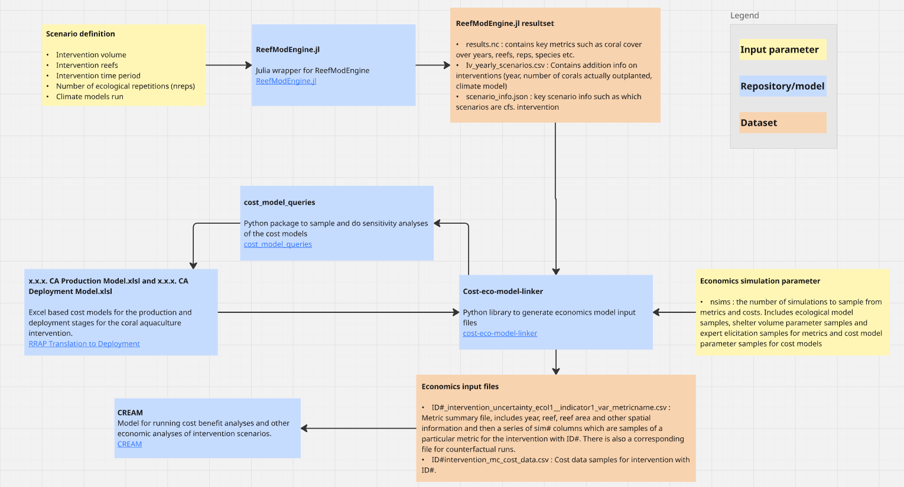

# cost-eco-model-linker documentation

A Python library for generating input files for the [CREAM](https://github.com/gbrrestoration/CREAM) economics analysis suite, using result sets from [ReefModEngine.jl](https://github.com/open-AIMS/ReefModEngine.jl).

The package repository is [here](https://github.com/open-AIMS/cost-eco-model-linker).

**Note: This package only works on Windows for now**

## Purpose

This package brings together results from ecological modelling and cost modelling to
provide predicted outcomes and costs in a format suitable to input to `CREAM`.

`CREAM` is a suite of functions which perform key economic analyses for reef restoration
projects, including:
- Cost Benefit Analysis (CBA), which looks at the difference in costs and
benefits, and
- Cost Effectiveness Anlysis (CEA), which looks at the cost per unit of
outcome.

To perform these analyses, `CREAM` requires information on the predicted benefits
of a particular reef restoration project over time and space, as well as the estimated
costs. Currently, `CREAM` only supports data from the ReefMod Engine.

The ecological outcomes are generated by calculating several metrics from the raw outputs
of model runs from `ReefModEngine.jl`, while the cost outcomes are generated by querying a
set of Excel-based cost models produced by the Translation to Deployment team.

Below is a diagram of the data flow:



## Contents

```{toctree}
:maxdepth: 2
:caption: User Guide

environment_setup
cost_models
generate_rme_results
metrics
output_file_format
example_workflow
context/01_Context
context/02_CostModels
context/03_EcologicalModels
context/04_LinkingCostAndEcologicalModels
context/05_AppendicesAndAcknowledgements
```
